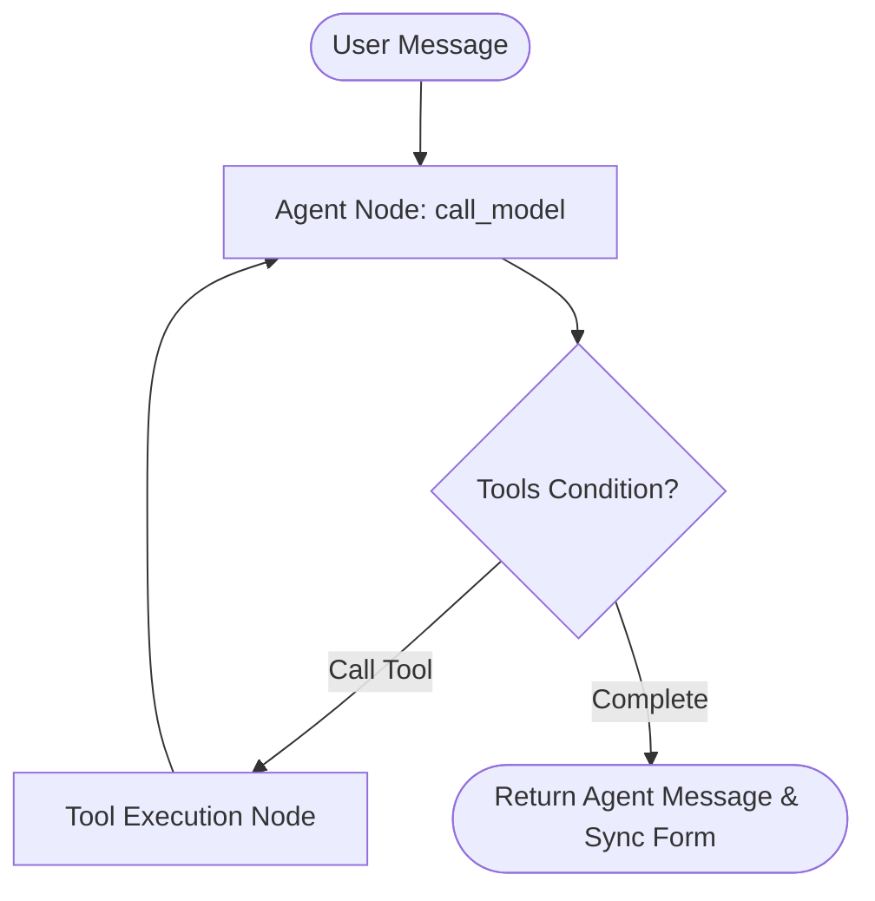

# AuraCRM - AI-First CRM HCP Module

Welcome to AuraCRM, a state-of-the-art AI-First Customer Relationship Management (CRM) module specifically tailored for Healthcare Professional (HCP) relations in the Life Sciences. 

AuraCRM is designed for pharmaceutical and medical representatives. It provides a dual-interface dashboard that bridges a structured logging form and a conversational AI agent. Reps can log discussions, query histories, generate summaries, and schedule follow-ups through both direct inputs and natural language chat, with both interfaces remaining in perfect synchronization.

---

## 🛠️ Technology Stack
* **Frontend**: React (v19) + TypeScript + Redux Toolkit (State Management) + Lucide Icons
* **Styling**: Modern CSS Grid/Flex System with custom dark slate and light mode variables, animations, and Google Inter font
* **Backend**: Python 3.10+ + FastAPI (Async REST APIs)
* **Agent Framework**: LangGraph + LangChain (Stateful Multi-Turn Conversations & Tool-Calling orchestration)
* **LLM Engine**: Groq API (`gemma2-9b-it` model)
* **ORM & Database**: SQLAlchemy with automatic schema creation. Defaults to SQLite for seamless zero-config execution, fully configured for PostgreSQL.

---

## 📂 Repository Folder Structure
```text
e:\Task\
├── backend\
│   ├── app\
│   │   ├── __init__.py
│   │   ├── config.py         # App configs, Pydantic-Settings env loading
│   │   ├── database.py       # SQLAlchemy engine & session generation
│   │   ├── models.py         # DB Tables (HCP, Interaction, FollowUp)
│   │   ├── schemas.py        # Pydantic v2 validation models
│   │   └── agent.py          # LangGraph state workflow, 5 Tools, and FastAPI API routes
│   ├── .env.example          # Environment variables template
│   └── requirements.txt      # Python dependencies
├── frontend\
│   ├── src\
│   │   ├── components\
│   │   │   ├── ChatInterface.tsx    # Conversational Chat Screen with Tool badge indicators
│   │   │   ├── StructuredForm.tsx   # Structured database input forms & AI summary trigger
│   │   │   └── ThemeToggle.tsx      # Dark Mode / Light Mode switcher
│   │   ├── store\
│   │   │   ├── store.ts             # Redux Store config
│   │   │   ├── chatSlice.ts         # Agent chat messages & loader states
│   │   │   └── interactionSlice.ts  # Form entries & live syncing actions
│   │   ├── App.tsx                  # Main entry screen with Form, Chat, and Split dashboards
│   │   ├── main.tsx                 # React mounting entrypoint
│   │   └── index.css                # Premium responsive styling sheet
│   ├── .env.example          # Frontend configuration template
│   ├── package.json              # NPM dependencies & scripts
│   ├── tsconfig.json             # TypeScript settings
│   └── vite.config.ts            # Vite compiler configuration
└── README.md                 # Complete documentation and setup manual
```

---

## 🧠 LangGraph Architecture & Tools

AuraCRM compiles a LangGraph state machine. Each user message executes a state loop that plans and calls tools before yielding a response.



### 1. The 5 LangGraph Tools
The agent binds 5 specific Python tools designed for life-science activities:
1. **`log_interaction`**: Captures discussion notes, date, and type for a specific HCP. It invokes the LLM under the hood to compile a clinical summary automatically, then saves the record to the database.
2. **`edit_interaction`**: Modifies database attributes for a pre-existing interaction ID.
3. **`search_hcp_history`**: Queries past interactions (notes, summaries, dates) for a particular HCP, supporting filter keywords.
4. **`summarize_interaction`**: Compiles an objective, professional clinical/business summary of raw discussion notes.
5. **`schedule_followup`**: Schedules future follow-up tasks (like sending literature or setting a demo date) for an HCP.

### 2. Live UI Form Synchronization
To establish a premium user experience, AuraCRM features a state-sync architecture:
* When the user types a request in the Chat view (e.g., *"Schedule a follow-up for Dr. Carter on July 10th to send product brochure"*), the agent calls the `schedule_followup` tool.
* The FastAPI endpoint parses the LangGraph message logs. If it detects a tool call execution during the turn, it extracts the parameters (e.g., `hcp_id`, `followup_date`, `task_description`).
* These extracted details are sent back in a dedicated `form_sync` response block.
* The Redux store receives this payload and immediately synchronizes the fields of the Structured Form on the left side of the screen. The user can toggle views or use the Dual Dashboard to watch the inputs update in real time.

---

## 🚀 Getting Started Instructions

### Prerequisite
* Python 3.10+ installed on your system.
* Node.js v18+ and NPM installed.
* A Groq API Key (get one free at [console.groq.com](https://console.groq.com/)).

---

### 1. Backend Server Setup
1. Open your terminal and navigate to the backend directory:
   ```bash
   cd e:\Task\backend
   ```
2. Create and activate a python virtual environment:
   ```bash
   python -m venv venv
   # On Windows (PowerShell):
   .\venv\Scripts\Activate.ps1
   # On Windows (CMD):
   .\venv\Scripts\activate.bat
   # On Linux/macOS:
   source venv/bin/activate
   ```
3. Install the dependencies:
   ```bash
   pip install -r requirements.txt
   ```
4. Create your local configuration file:
   ```bash
   copy .env.example .env
   ```
   Open the `.env` file and input your Groq API Key:
   ```env
   GROQ_API_KEY=gsk_your_groq_api_token_here
   ```
5. Start the FastAPI development server:
   ```bash
   uvicorn app.agent:app --reload
   ```
   The backend will start running at `http://localhost:8000`. On initial startup, the database is generated locally (`sqlite:///./hcp_crm.db`) and **automatically seeded** with three sample HCPs:
   * **Dr. Sarah Jenkins** (Cardiology, ID: `1`)
   * **Dr. James Carter** (Oncology, ID: `2`)
   * **Dr. Elena Rostova** (Neurology, ID: `3`)

---

### 2. Frontend Application Setup
1. Open a new terminal window and navigate to the frontend directory:
   ```bash
   cd e:\Task\frontend
   ```
2. Install package dependencies:
   ```bash
   npm install
   ```
3. Create your local env file:
   ```bash
   copy .env.example .env
   ```
4. Run the Vite development server:
   ```bash
   npm run dev
   ```
5. Open your browser and navigate to the URL printed in the terminal (usually `http://localhost:5173`).

---

## 💡 Recommended Test Prompts for AI Chat Agent
Once both services are running, select the **Dual Dashboard** view in the UI and try entering these prompts in the chat box:
1. **Search History**: *"Search previous interactions for Dr. Sarah Jenkins (HCP ID 1)"* -> The agent will invoke `search_hcp_history` and output the past logged records.
2. **Log a Meeting**: *"I met with Dr. Jenkins today (HCP 1) and we had an in-person meeting. She was very interested in the new efficacy data for our cardiovascular drug."* -> The agent will call `log_interaction` (which automatically generates a summary) and update the form fields.
3. **Schedule Followup**: *"Schedule a follow-up with Dr. Carter (ID 2) for next Friday 2026-07-17 to send the oncology booklet"* -> The agent will invoke `schedule_followup` to log it and fill in the follow-up form parameters.
